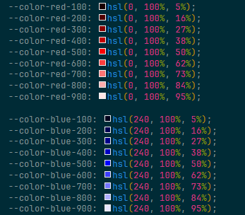
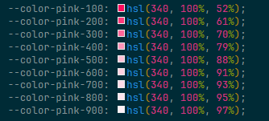

# @uinamic/colors 🎨 (0.2 version)

> HSL 기반 명도 중심 색상 스펙트럼을 자동 생성해주는 CSS 변수 토큰 생성기입니다.

## ✨ 주요 특징

-   중심 명도(L)를 기준으로 9단계 비대칭 스펙트럼 생성 (100~900)
-   극단 영역 자동 감지 및 **밝기 보정 알고리즘** 탑재
-   perceptual 균형을 고려한 **1:4 분포 기반 색상 계산**
-   `:root` 내 CSS 변수 혹은 SCSS/JSON 포맷 지원
-   zero-dependency, 빠른 실행, CLI 및 API 모두 사용 가능

## 📐 스펙트럼 구조

`generateColorTokens()`는 다음과 같은 방식으로 스펙트럼을 생성합니다:

-   중심 명도값(`centerL`)을 기준으로 **비대칭적 9단계 명도 분포**를 만듭니다.
-   스펙트럼은 다음과 같은 특성을 가집니다:
    -   중심에 가까운 구간일수록 **명도 변화가 더 크고**
    -   멀어질수록 **변화량이 줄어드는 완화형 분포**
    -   낮은 방향은 부드럽게 내려가고, 높은 방향은 넓게 확장됩니다.

### 예시 centerL = 50

```
[5, 16, 27, 38, (50), 62, 73, 84, 95]
[  ↑   ↑   ↑   ↑     ↑   ↑   ↑   ↑]
[ 11  11  11  12     12  11  11  11] ← 명도 간격
```



-   (50)은 중심 명도값
-   좌우가 **거의 대칭적인 비율**이지만, 12 중심부를 기점으로 약간의 비율 조정이 있습니다.
-   `smartBias + delta 가중치`를 이용해 감각적으로 자연스러운 스펙트럼을 생성합니다.

-   **단, 중심값이 극단(≤22 또는 ≥78)일 경우:**
    -   limit값은 3으로 고정하며
    -   낮은 쪽 범위는 `lowRange = centerL - 3`
    -   높은 쪽은 `highRange = lowRange * 4` 비율로 보정합니다.
    -   스펙트럼 전체가 0~100 범위 내에서 유지되도록 자동 조정합니다.

### 예시

```ts
pink: [340, 100, 88] →  [52, 58, 64, 70, 76, 82, 88, 94, 97]
```



## 📂 옵션 설명

| 옵션   | 설명                                                                                                           |
| ------ | -------------------------------------------------------------------------------------------------------------- |
| format | 출력 포맷을 지정합니다. (기본값: 'css') / 'css', 'scss', 'json' 중 하나를 선택할 수 있습니다.                  |
| prefix | CSS 변수 앞에 붙일 접두사를 지정합니다. (기본값: '--color-') / SCSS 포맷일 경우 $가 자동으로 붙을 수 있습니다. |
| name   | 생성할 파일명을 지정합니다. (기본값: 'uinamic-color')                                                          |
| path   | 파일 저장 경로를 지정합니다. (기본값: './theme')                                                               |

## 📦 설치

```bash
npm install @uinamic/colors
```

or

```bash
pnpm add @uinamic/colors
```

## 🛠️ 사용법

### 🧭 1. 터미널에서 바로 실행

-   출력 파일 기본 경로: `./theme/color.css`

```bash
# bash
npx @uinamic/colors
```

-   출력 파일 경로 지정

```bash
# bash
npx @uinamic/colors --path ./custom --name variant --format scss --prefix font --limit 5
```

### 🧭 2. 사용자 정의 색상맵 사용

```js
// generate-color-css.js
import { generateColorTokens } from '@uinamic/colors'

// 사용자 정의 색상맵
const myColorMap = {
    mint: [160, 100, 50],
    coral: [16, 100, 60],
}

// CSS 변수 문자열 생성
const css = generateColorTokens(myColorMap)

// terminal
node generate-color-css.js
```

## 🎨 변수 포맷 출력

generateColorTokens() 함수는 format: 'scss' 옵션을 사용하면 Sass에서 사용 가능한 $변수 형태의 색상 스펙트럼 토큰을 자동 생성합니다.

```js
// color-css.js
import { generateColorTokens } from '@uinamic/colors'

const scss = generateColorTokens(
    {
        mint: [160, 100, 50],
    },
    {
        format: 'scss', // SCSS 포맷
        prefix: 'theme', // 접두사 지정
        name: 'color', // 파일명 지정
        path: './custom', // 파일 경로 지정
        limit: 8, // 명도의 범위 지정
    }
)
```

## 🧪 실행 방법

```bash
# bash
node color-css.js
```

#### 출력 결과 예시

`./custom/color.scss`

```scss
$theme-mint-100: hsl(160, 100%, 8%);
$theme-mint-200: hsl(160, 100%, 18%);
$theme-mint-300: hsl(160, 100%, 28%);
$theme-mint-400: hsl(160, 100%, 39%);
$theme-mint-500: hsl(160, 100%, 50%);
$theme-mint-600: hsl(160, 100%, 61%);
$theme-mint-700: hsl(160, 100%, 72%);
$theme-mint-800: hsl(160, 100%, 82%);
$theme-mint-900: hsl(160, 100%, 92%);
```

## 🎨 기본 제공 색상맵

```js
{
    red: [0, 100, 50],
    blue: [240, 100, 50],
    yellow: [60, 100, 50],
    orange: [39, 100, 50],
    green: [120, 100, 40],
    purple: [270, 100, 60],
    pink: [340, 100, 88],
    teal: [180, 100, 45],

    gray: [0, 0, 50],
    darkgray: [0, 0, 30],
    lightgray: [0, 0, 70],

    coral: [16, 100, 65],
    mint: [160, 100, 50],
    cyan: [190, 100, 60],
    violet: [290, 76, 72],
    indigo: [225, 100, 45],
    amber: [45, 100, 50],
}
``
```

## 💡 출력 예시 (CSS 변수)

```css
:root {
    --color-black: hsl(0, 0%, 0%);
    --color-white: hsl(0, 0%, 100%);

    --color-red-100: hsl(0, 100%, 5%);
    --color-red-200: hsl(0, 100%, 16%);
    --color-red-300: hsl(0, 100%, 27%);
    --color-red-400: hsl(0, 100%, 38%);
    --color-red-500: hsl(0, 100%, 50%);
    --color-red-600: hsl(0, 100%, 62%);
    --color-red-700: hsl(0, 100%, 73%);
    --color-red-800: hsl(0, 100%, 84%);
    --color-red-900: hsl(0, 100%, 95%);

    --color-blue-100: hsl(240, 100%, 5%);
    --color-blue-200: hsl(240, 100%, 16%);
    --color-blue-300: hsl(240, 100%, 27%);
    --color-blue-400: hsl(240, 100%, 38%);
    --color-blue-500: hsl(240, 100%, 50%);
    --color-blue-600: hsl(240, 100%, 62%);
    --color-blue-700: hsl(240, 100%, 73%);
    --color-blue-800: hsl(240, 100%, 84%);
    --color-blue-900: hsl(240, 100%, 95%);
}
```
